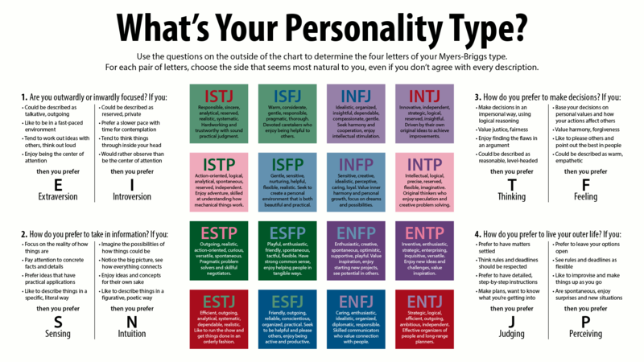
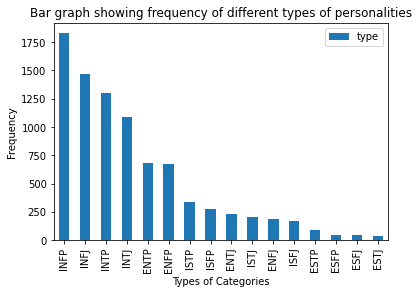
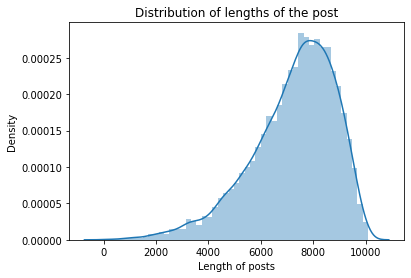
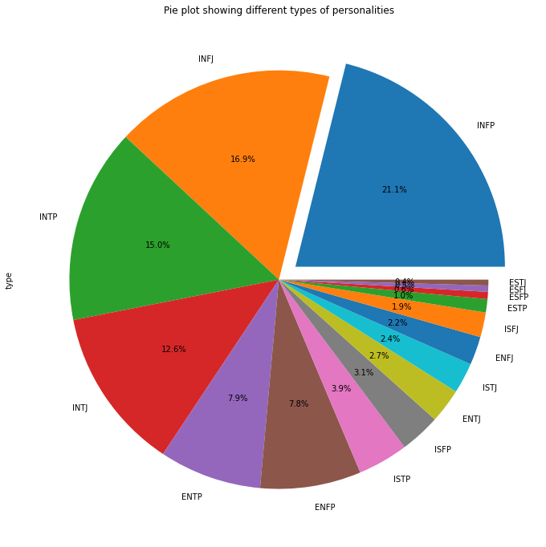

# MBTI Personality Prediction using Machine Learning
## Introduction
The Myers Briggs Type Indicator (MBTI) is a personality type system that divides everyone into 16 distinct personalities based on four dimensions, namely: Introversion (I) - Extroversion (E), Intuition (N) - Sensing (S), Thinking (T) - Feeling (F), Judging (J) - Perceiving (P). MBTI is widely used by companies, recommendation systems, and other research domains. Researchers widely use machine learning and deep learning algorithms to predict personality and psychological traits from digital records. In this project, I have developed a MBTI personality classifier that uses machine learning models to predict a person’s personality based on the 50 recent social media posts per user as input.

 
<i>(Image source : Wikipedia)</i>

## Methodology
### Exploring the Dataset
The [dataset used](https://www.kaggle.com/datasets/datasnaek/mbti-type?select=mbti_1.csv) has:
- 8675 rows
- 2 columns
  - type
  - posts.

The data in column ‘post’ contains 50 recent social media posts for each user. There are 16 unique labels in column ‘type’ with no null
values, each representing 16 MBTI type indicators. The post column had paragraphs which required some natural language processing in order to
perform the task of model training.

  
   
  

### Preprocessing
This is performed in order to reduced the inconsistency in the data by removing terms which do not contribute much to the person's personality.
1) Converting data in post column to lowercase so that 2 identical words written in different letter cases can be interpreted as similar.
2) Removing URLs and links
3) Removing special characters like ' , ', ' | ', ' - ' etc. and numbers 
4) Removing extra spaces
5) Removing stopwords such as ‘for’, ‘them’, ‘you’ etc. using the `nltk` library.
6) Perform word Lemmatization i.e. grouping of words with the same purpose together (e.g. gone, going, went to go).
### Models implemented
There are various classification algorithms present out of which I have implemented the following:
- Gaussian Naive Bayes
- Multinomial Naive Bayes
- Random Forest Classifier
- XGBoost Classifier
- LightGBM Classifier
- Support Vector Classifier
- Logistic Regression
## Result & Analysis
I started with the naive Bayes classifier, I implemented the gaussian naive bayes as the distribution was close to normal, but the
result obtained based on the metrics like precision, recall and accuracy were quite unsatisfactory. Therefore I decided to
implement another naive bayes classifier algorithm which is multinomial naive bayes but similar results were obtained as in the
case of gaussian naive bayes. After applying various kinds of models with different workings, the best result obtained on the basis
of accuracy score, precision, recall, and f1 score was the XGBoost model. More accurate results can be obtained by training
models on a larger and more accurate dataset. Companies can use the results of the MBTI personality test to understand their
employees’ behavior, including their strengths and shortcomings, as well as how they perceive, process, and interpret information.
